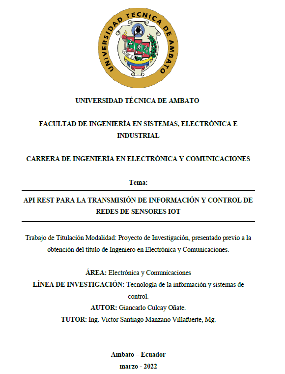
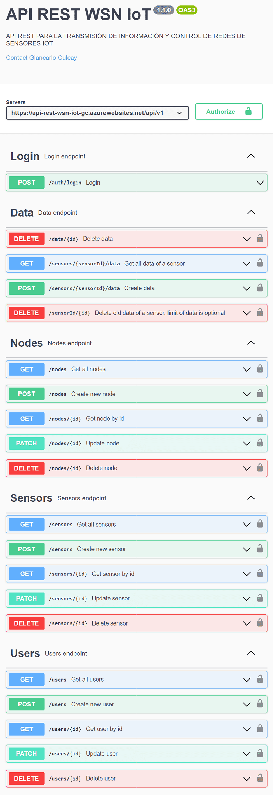
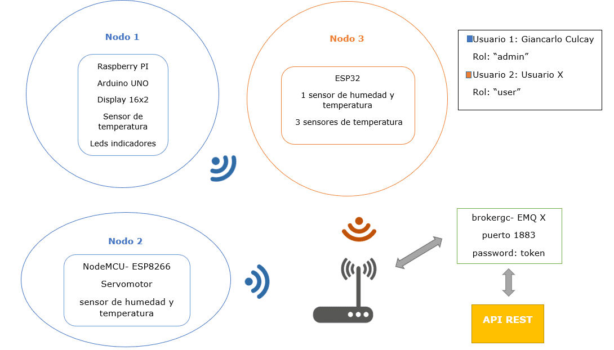
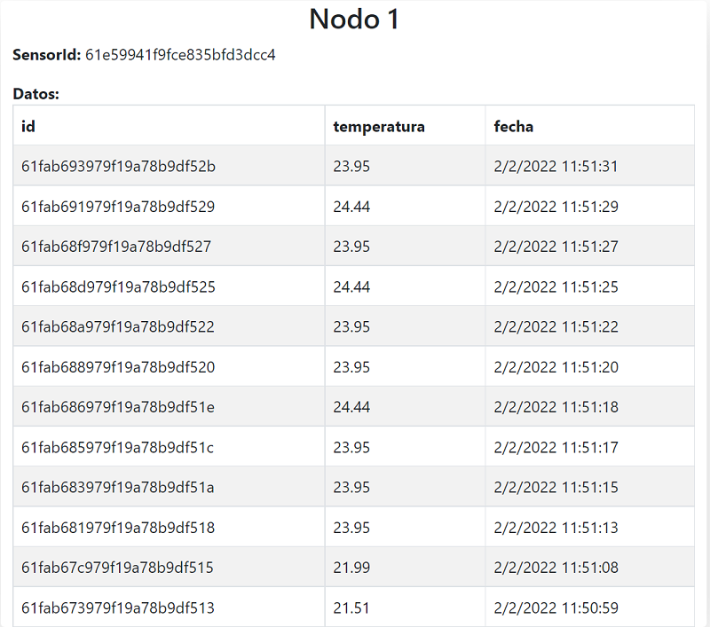

# API REST PARA LA TRANSMISIÓN DE INFORMACIÓN Y CONTROL DE REDES DE SENSORES IOT



### Autor

- Ing. Giancarlo Culcay - [giancode1](https://github.com/giancode1)
- LinkedIn - [Linkedin](https://www.linkedin.com/in/giancarlo-culcay/)
- Twitter - [@gianccool](https://twitter.com/GiancCool)
- Website - [https://www.giancarlo-culcay.com/](https://www.giancarlo-culcay.com/)

## Resumen

La cantidad de datos que el Internet de las cosas genera está creciendo de forma exponencial, cada vez son más los dispositivos llamados “cosas” que se conectan a internet y proporcionan datos de importancia para diferentes sectores, acceder a estos miles de datos es complicado con las técnicas convencionales, además en estos últimos años por el tema de la pandemia fue necesario que los dispositivos se configuren a distancia y faciliten mucho trabajo. Este proyecto analiza las tecnologías para el funcionamiento de las redes de sensores, IoT, protocolos de comunicación para el IoT y desarrolla una API REST con Node.js y Express para que los usuarios puedan crear los recursos (nodos, sensores, datos) cada uno relacionado con el otro. Se usa los servicios en la nube para desplegar un contenedor de broker: EMQ X el cual sirve como servidor para las conexiones de los dispositivos IoT, mediante la suscripción y publicación de datos ordenados por su id de sensor. Como la seguridad de estas redes ha dado mucho que hablar, las conexiones MQTT son autenticadas mediante un token de seguridad y no se permiten conexiones anónimas. Este proyecto usa soluciones serverless, la aplicación API REST se encuentra alojada en el servicio de App Service de Azure y cualquier cliente que desea obtener datos de la API debe tener un usuario registrado y cada vez que realice las solicitudes debe contar con un token de acceso. Se usa bases de datos de MongoDB por su rendimiento, documentos ligeros y permitir datos sin estructura fija para las características de los sensores y datos que pueden tener diferentes valores, y que cambian continuamente. Los usuarios pueden realizar las operaciones CRUD con los recursos, y para obtener los datos pueden especificar el límite, offset, fecha de los datos que deseen obtener.

[Link Documento Publicado](https://repositorio.uta.edu.ec/handle/123456789/35022)  
[Link Proyecto Backend](https://api-rest-wsn-iot-gc.azurewebsites.net/docs/)



## Banco de Pruebas



## Ejemplos consultas endpoints

### Nodo 1, Datos Página Web



Para ver la información de los nodos restantes visita el [Proyecto](https://repositorio.uta.edu.ec/handle/123456789/35022) en la cual se detalla los datos y sus configuraciones.

- Comunicación Asíncrona
- Autenticación, Autorización
- JWT
- Comunicación bidireccional con dispositivos iot
- Datos, configuración

## Tecnologias, dipositivos usados en el proyecto

- Node.js
- Express
- HTML/CSS/JavaScript
- TypeScript
- Python 3
- NoSQL - MongoDB
- Contenedores Docker
- Microsoft Azure
- MQTT
- React Native
- JMeter

## Dipositivos usados en el proyecto

- Arduino
- ESP32
- ESP8266
- PIC
- Sensores varios
- LCD
- Raspberry PI

## Instalar dependencias

```bash
npm install
# or
yarn
```
